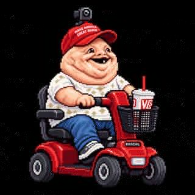

# Chudley

<p align="center">
  
</p>

<p align="center"><strong>A tiny desktop Codex pet with entirely too much personality.</strong></p>

Chudley is a public experiment in building a sprite-driven desktop pet from a locked character design, then handing the implementation work to an AI coding agent. The goal is simple: make the little menace animate cleanly, behave predictably, and remain easy to extend without turning the repository into a haunted appliance.

> **Status:** pre-implementation. Character art is being finalized before coding begins.

## Project goals

- Preserve one consistent character design across every sprite and animation.
- Keep art assets separate from application code.
- Make animation states easy to add or replace.
- Keep the eventual desktop pet lightweight and local-first.
- Use the project as a low-risk test bed for AI-directed implementation and review.

## Repository layout

```text
assets/
  readme/        README artwork
  reference/     canonical character references
  sprites/       approved production sprite sheets and frames

docs/
  ART-PIPELINE.md
  PROJECT-BRIEF.md
```

Implementation folders will be added once the application stack is selected.

## Asset authority

The large approved character reference is the source of truth for Chudley's identity. A refined master sprite sheet will become the source of truth for pixel treatment, proportions, palette, frame scale, and animation consistency.

See [docs/ART-PIPELINE.md](docs/ART-PIPELINE.md).

## Development approach

The project is intentionally being built in stages:

1. lock the character design;
2. produce and approve the canonical master sprite sheet;
3. expand the animation library;
4. implement the desktop pet;
5. test behavior, packaging, and extensibility;
6. publish releases once the creature can be trusted around civilians.

## License

No open-source license has been selected yet. Until one is added, normal copyright restrictions apply.

## Disclaimer

This is a parody/experimental software project. It is not affiliated with or endorsed by OpenAI, Anthropic, any political campaign, or the brands depicted in the artwork.
